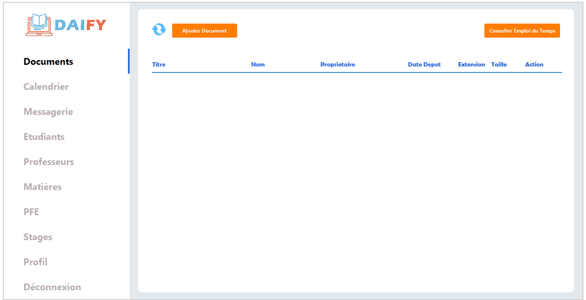
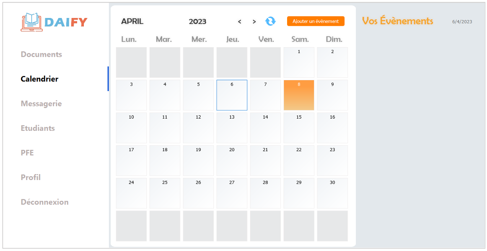

# RAPPORT DU PROJET : DAIFY
# DAIFY -  application de gestion de la filière Développeur d’Applications Informatiques (ESTO)
## Sommaire
1. [Présentation de l'équipe](#1-présentation-de-léquipe)
2. [Problématique](#2-problématique)
3. [Solution proposée](#3-solution-proposée)
4. [Technologies Utilisées](#4-technologies-utilisées)
5. [Fonctionnalités](#5-fonctionnalités)
6. [Captures d'écran](#6-captures-décran-)
---
## 1. Présentation de l'équipe 
```
Projet Fin d'Etudes 
Encadrant  :  M. SERGHINI Abdelhafid
Réalisé par :  
   > CHARI Milouda             
   > ES-SOUFI Doha
```
## 2. Problématique
Durant chaque année universitaire, les tâches réalisées au sein de notre filière demeurent nombreuses. Le responsable de la filière doit piloter les professeurs en les affectant aux modules enseignés et en réalisant les emplois du temps correspondants. De même, les professeurs doivent gérer les notes des modules de chaque étudiant.

Ce travail était accompli presque manuellement en se basant sur des logiciels bureautiques, ce qui pose plusieurs problèmes :
- **Désorganisation de l’information** : Les informations sont dispersées sur différents fichiers et plateformes, ce qui rend les étudiants et professeurs confus.
- **Décentralisation et redondance de l’information** : L’information est stockée dans plusieurs fichiers Excel, ce qui nécessite une mise à jour constante pour garantir l'intégrité des données.
- **Difficultés de communication** : Le transfert de l’information se fait par divers moyens tels que Gmail ou WhatsApp, rendant la gestion des messages difficile et saturée.
## 3. Solution proposée
Pour faire face aux imperfections citées dans la section précédente, nous proposons la mise en place d’une application qui va permettre au département informatique et la filière DAI en particulier de digitaliser ses services, de communiquer aisément, d'une manière souple, instantanée, bien organisée, plus productive et fluide, tout en réduisant le temps et les efforts. En outre, l’application va aider le responsable de la filière à automatiser son processus de gestion en ce qui concerne l'organisation des documents et les inscriptions, elle va aussi donner lieu aux profs de programmer des devoirs organisés sur un calendrier et de déposer les cours pour les étudiants.

## 4. Technologies Utilisées
- **NetBeans** : IDE utilisé pour développer l’application en Java.
- **Java** : Langage de programmation pour le backend.
- **JavaFX** : Framework pour l'interface utilisateur riche et interactive.
- **Visual Paradigm** : Outil UML pour la modélisation du système.
- **Jira Software** : Outil de gestion de projet pour la planification et le suivi des tâches.
- - **MySQL** : Système de gestion de base de données relationnelle.

## 5. Fonctionnalités
Espace responsable de la filière : 
- **Gérer les étudiants** : L’application affiche une interface qui liste l’ensemble des étudiants. Le responsable peut ajouter, modifier et supprimer.
- **Gérer les professeurs** : L’application affiche une interface qui liste l’ensemble des professeurs de la filière. Le responsable peut ajouter, modifier et supprimer.
- **Affecter les matières** : L’application affiche une interface qui liste l’ensemble des modules de la filière à travers laquelle il peut assigner des professeurs aux matières.
- **Déposer des documents** : L’application affiche une interface qui liste les différents documents y compris les emplois du temps déposés par le responsable. Il peut ajouter, télécharger, modifier et supprimer ses documents.
- **Communiquer** : L’application affiche la boite de réception du responsable, il peut également envoyer un message.
- **Planifier un événement** : L’application affiche une interface qui contient le calendrier du mois, le responsable peut également basculer vers les mois suivants ou précédents.  Le responsable peut également planifier, modifier et supprimer un évènement.
- **Affecter PFE** : L'application affiche une interface qui liste les différents groupes d’étudiants, le responsable doit choisir le nombre de sujets PFE de chaque professeur, et associer aléatoirement les sujets aux groupes.
- **Consulter les stages** : L’application affiche une interface qui liste les différents stages effectués par les étudiants.


Espace professeur : 
- **Gérer les notes** : L’application affiche une interface qui liste l’ensemble des étudiants de la filière à travers laquelle il peut saisir les notes des examens effectués, l’assiduité et calculer la moyenne de chaque étudiant.
- **Déposer les documents** : L’application affiche une interface qui liste les différents documents y compris les emplois du temps déposés par le responsable. Il peut ajouter, télécharger, modifier et supprimer ses documents.
- **Communiquer** : L’application affiche la boite de réception du professeur, il peut également envoyer un message.
- **Planifier un évènement** : L’application affiche une interface qui contient le calendrier du mois, le professeur peut également basculer vers les mois suivants ou précédents.  Le professeur peut également planifier, modifier et supprimer un évènement.
- Saisir les Sujets PFE : L’application affiche une interface qui permet au professeur de saisir ses sujets PFE selon le nombre affecté par le responsable de la filière.
Espace Etudiant :
- **Accéder aux documents déposés** :  L’application affiche une interface qui liste les différents documents déposés par les professeurs et le responsable de la filière, il peut également les télécharger.
- **Accéder aux notes** :  L’application affiche une interface qui liste l’ensemble des matières et notes correspondantes à l’étudiant.
- **Communiquer** :  L’application affiche la boite de réception de l’étudiant, il peut également envoyer un message.
- **Accéder aux évènements plnifiés** : L’application affiche une interface qui contient le calendrier du mois de la consultation par défaut, l’étudiant peut également basculer vers les mois suivants ou précédents.
- **Former les groupes PFE** : L’application affiche une interface qui permet à l’étudiant de sélectionner deux ou trois étudiants pour former leur groupe.
- **Saisir le stage** : L’application affiche une interface qui permet à l’étudiant de saisir les informations de son stage. 
## 6. Captures d'écran :
- **Espace Responsable de filière** : 





- **Espace Professeur** :



- **Espace Etudiant** : 


